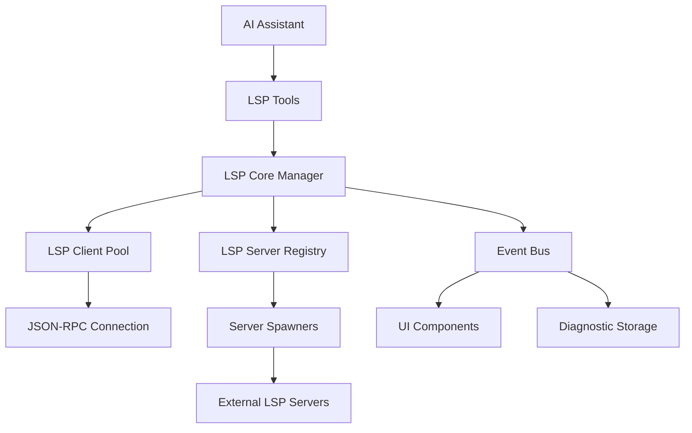
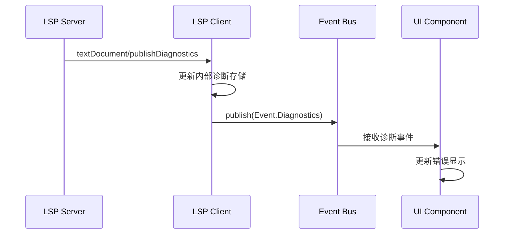

# OpenCode LSP 支持技术文档

## 概述

OpenCode 通过内置的 Language Server Protocol (LSP) 支持为 AI 助手提供强大的代码智能功能。该系统支持 25+ 种编程语言，集成了自动服务器管理、实时诊断、代码导航等高级功能，使 AI 能够像现代 IDE 一样理解和操作代码。

## 架构概览

### 核心架构



OpenCode LSP 系统采用分层架构设计：

- **工具层**：为 AI 提供 LSP 功能的统一接口
- **管理层**：负责服务器生命周期和客户端池管理
- **通信层**：处理 JSON-RPC 协议通信
- **服务器层**：支持 25+ 种语言的服务器配置

## 核心组件

### 1. LSP Core Manager (`lsp/index.ts`)

核心管理器，负责整个 LSP 系统的协调：

```typescript
// 状态管理结构
interface LSPState {
  broken: Set<string> // 失败的服务器标识
  servers: Record<string, LSPServer.Info> // 可用服务器配置
  clients: LSPClient.Info[] // 活跃客户端
  spawning: Map<string, Promise<LSPClient.Info | undefined>> // 启动中的任务
}
```

**关键功能：**

- **服务器注册与过滤**：根据配置和实验性标志启用/禁用服务器
- **客户端生命周期管理**：按需创建、复用和清理客户端
- **操作分发**：将 LSP 请求路由到适当的客户端

**服务器过滤逻辑：**

```typescript
const filterExperimentalServers = (servers: Record<string, LSPServer.Info>) => {
  if (Flag.OPENCODE_EXPERIMENTAL_LSP_TY) {
    // 启用实验性 Ty LSP 时禁用 Pyright
    if (servers["pyright"]) {
      delete servers["pyright"]
    }
  } else {
    // 否则禁用 Ty
    if (servers["ty"]) {
      delete servers["ty"]
    }
  }
}
```

### 2. LSP Client (`lsp/client.ts`)

实现与 LSP 服务器的 JSON-RPC 通信：

```typescript
export interface LSPClient {
  serverID: string
  root: string
  connection: MessageConnection
  notify: {
    open(input: { path: string }): Promise<void>
  }
  diagnostics: Map<string, Diagnostic[]>
  waitForDiagnostics(input: { path: string }): Promise<void>
  shutdown(): Promise<void>
}
```

**核心特性：**

- **协议实现**：完整的 LSP 协议支持，包括初始化握手
- **文档同步**：自动处理 `didOpen` 和 `didChange` 通知
- **诊断管理**：实时接收和存储诊断信息
- **事件发布**：通过事件总线分发诊断更新

**初始化流程：**

```typescript
// 发送初始化请求
await connection.sendRequest("initialize", {
  rootUri: pathToFileURL(input.root).href,
  processId: input.server.process.pid,
  workspaceFolders: [
    {
      name: "workspace",
      uri: pathToFileURL(input.root).href,
    },
  ],
  initializationOptions: input.server.initialization,
  capabilities: {
    window: { workDoneProgress: true },
    workspace: { configuration: true },
    textDocument: {
      synchronization: { didOpen: true, didChange: true },
      publishDiagnostics: { versionSupport: true },
    },
  },
})
```

### 3. LSP Server Registry (`lsp/server.ts`)

包含 25+ 种语言的服务器配置和自动安装逻辑：

**服务器配置接口：**

```typescript
export interface LSPServer.Info {
  id: string                    // 服务器唯一标识
  extensions: string[]          // 支持的文件扩展名
  global?: boolean             // 是否为全局服务器
  root: RootFunction          // 项目根目录检测函数
  spawn(root: string): Promise<Handle | undefined> // 服务器启动函数
}

type RootFunction = (file: string) => Promise<string | undefined>
```

**智能根目录检测：**

```typescript
const NearestRoot = (includePatterns: string[], excludePatterns?: string[]): RootFunction => {
  return async (file) => {
    // 排除模式检查
    if (excludePatterns) {
      const excludedFiles = Filesystem.up({
        targets: excludePatterns,
        start: path.dirname(file),
        stop: Instance.directory,
      })
      const excluded = await excludedFiles.next()
      if (excluded.value) return undefined
    }

    // 包含模式检查
    const files = Filesystem.up({
      targets: includePatterns,
      start: path.dirname(file),
      stop: Instance.directory,
    })
    const first = await files.next()
    if (!first.value) return Instance.directory
    return path.dirname(first.value)
  }
}
```

## 服务器生命周期管理

### 启动流程

1. **文件检测**：当打开文件时，根据扩展名匹配适用的服务器
2. **根目录查找**：使用配置的模式递归向上查找项目根目录
3. **服务器准备**：检查二进制文件存在性，必要时自动下载安装
4. **进程启动**：生成子进程并建立 JSON-RPC 连接
5. **客户端创建**：初始化 LSP 客户端并完成握手
6. **文档通知**：向服务器发送文件打开通知

### 自动安装机制

许多 LSP 服务器支持自动安装：

```typescript
// TypeScript 服务器自动安装示例
export const Typescript: Info = {
  id: "typescript",
  root: NearestRoot(
    ["package-lock.json", "bun.lockb", "bun.lock", "pnpm-lock.yaml", "yarn.lock"],
    ["deno.json", "deno.jsonc"],
  ),
  extensions: [".ts", ".tsx", ".js", ".jsx", ".mjs", ".cjs", ".mts", ".cts"],
  async spawn(root) {
    const tsserver = await Bun.resolve("typescript/lib/tsserver.js", Instance.directory)
    if (!tsserver) return

    const proc = spawn(BunProc.which(), ["x", "typescript-language-server", "--stdio"], {
      cwd: root,
      env: { ...process.env, BUN_BE_BUN: "1" },
    })

    return {
      process: proc,
      initialization: { tsserver: { path: tsserver } },
    }
  },
}
```

### 故障恢复机制

```typescript
async function schedule(server: LSPServer.Info, root: string, key: string) {
  try {
    const handle = await server.spawn(root)
    if (!handle) {
      state.broken.add(key) // 标记为失败
      return undefined
    }

    const client = await LSPClient.create({
      serverID: server.id,
      server: handle,
      root,
    })

    if (!client) {
      handle.process.kill()
      state.broken.add(key)
      return undefined
    }

    return client
  } catch (err) {
    state.broken.add(key)
    log.error(`Failed to spawn LSP server ${server.id}`, { error: err })
    return undefined
  }
}
```

## 客户端-服务器通信

### JSON-RPC 协议实现

使用 `vscode-jsonrpc` 库实现标准 LSP 协议：

```typescript
const connection = createMessageConnection(
  new StreamMessageReader(input.server.process.stdout as any),
  new StreamMessageWriter(input.server.process.stdin as any),
)
```

### 消息处理架构

```typescript
// 诊断通知处理
connection.onNotification("textDocument/publishDiagnostics", (params) => {
  const filePath = Filesystem.normalizePath(fileURLToPath(params.uri))
  const exists = diagnostics.has(filePath)
  diagnostics.set(filePath, params.diagnostics)

  // 特殊处理：TypeScript 服务器首次不立即发布
  if (!exists && input.serverID === "typescript") return

  Bus.publish(Event.Diagnostics, {
    path: filePath,
    serverID: input.serverID,
  })
})
```

### 请求处理

支持所有主要 LSP 操作：

```typescript
// 定义操作
const operations = [
  "goToDefinition",
  "findReferences",
  "hover",
  "documentSymbol",
  "workspaceSymbol",
  "goToImplementation",
  "prepareCallHierarchy",
  "incomingCalls",
  "outgoingCalls",
] as const
```

## 工具集成

### 统一 LSP 工具 (`tool/lsp.ts`)

为 AI 助手提供标准化的 LSP 操作接口：

```typescript
export const LspTool = Tool.define("lsp", {
  parameters: z.object({
    operation: z.enum(operations),
    filePath: z.string(),
    line: z.number().int().min(1),
    character: z.number().int().min(1),
  }),
  execute: async (args) => {
    const file = path.isAbsolute(args.filePath) ? args.filePath : path.join(Instance.directory, args.filePath)

    const position = {
      file,
      line: args.line - 1, // 转换为 0-based
      character: args.character - 1,
    }

    await LSP.touchFile(file, true) // 确保文件已同步

    const result = await (() => {
      switch (args.operation) {
        case "goToDefinition":
          return LSP.definition(position)
        case "findReferences":
          return LSP.references(position)
        case "hover":
          return LSP.hover(position)
        // ... 其他操作
      }
    })()

    return {
      title: `${args.operation} ${relPath}:${args.line}:${args.character}`,
      metadata: { result },
      output: JSON.stringify(result, null, 2),
    }
  },
})
```

### 专用诊断工具

```typescript
export const LspDiagnosticTool = Tool.define("lsp_diagnostics", {
  parameters: z.object({
    path: z.string(),
  }),
  execute: async (args) => {
    const normalized = path.isAbsolute(args.path) ? args.path : path.join(Instance.directory, args.path)

    await LSP.touchFile(normalized, true)
    const diagnostics = await LSP.diagnostics()
    const fileDiagnostics = diagnostics[normalized]

    return {
      title: path.relative(Instance.worktree, normalized),
      metadata: { diagnostics },
      output: fileDiagnostics?.length ? fileDiagnostics.map(LSP.Diagnostic.pretty).join("\n") : "No errors found",
    }
  },
})
```

## 事件系统

### 事件驱动架构

使用事件总线实现组件间的松耦合通信：

```typescript
// LSP 事件定义
export const Event = {
  Updated: BusEvent.define("lsp.updated", z.object({})),
}

// 客户端事件
export const Event = {
  Diagnostics: BusEvent.define(
    "lsp.client.diagnostics",
    z.object({
      serverID: z.string(),
      path: z.string(),
    }),
  ),
}
```

### 诊断事件流



### 等待诊断机制

```typescript
async waitForDiagnostics(input: { path: string }) {
  const normalizedPath = Filesystem.normalizePath(input.path)
  let unsub: () => void
  let debounceTimer: ReturnType<typeof setTimeout> | undefined

  return await withTimeout(
    new Promise<void>((resolve) => {
      unsub = Bus.subscribe(Event.Diagnostics, (event) => {
        if (event.properties.path === normalizedPath &&
            event.properties.serverID === result.serverID) {
          // 防抖处理，等待后续诊断
          if (debounceTimer) clearTimeout(debounceTimer)
          debounceTimer = setTimeout(() => {
            unsub?.()
            resolve()
          }, DIAGNOSTICS_DEBOUNCE_MS) // 150ms
        }
      })
    }),
    3000 // 3秒超时
  )
}
```

## 配置系统

### 分层配置架构

配置按优先级合并：

1. **全局默认配置**
2. **自定义配置文件** (`OPENCODE_CONFIG` 环境变量)
3. **项目配置文件** (`opencode.jsonc`, `opencode.json`)

### LSP 配置结构

```typescript
// 配置架构定义
const LspConfig = z.object({
  disabled: z.boolean().optional(),
  command: z.array(z.string()).optional(),
  extensions: z.array(z.string()).optional(),
  env: z.record(z.string()).optional(),
  initialization: z.record(z.any()).optional(),
})
```

### 配置示例

```json
{
  "$schema": "https://opencode.ai/config.json",
  "lsp": {
    "pyright": {
      "disabled": false,
      "command": ["pyright-langserver", "--stdio"],
      "extensions": [".py", ".pyi"],
      "initialization": {
        "pythonPath": "/path/to/venv/bin/python"
      }
    },
    "rust": {
      "disabled": true // 禁用 Rust 服务器
    },
    "custom-language": {
      "command": ["/usr/local/bin/custom-lsp"],
      "extensions": [".custom"]
    }
  }
}
```

## 支持的语言

### 内置语言服务器

| 语言       | 服务器 ID          | 扩展名                       | 自动安装 | 特殊要求                 |
| ---------- | ------------------ | ---------------------------- | -------- | ------------------------ |
| TypeScript | `typescript`       | `.ts`, `.tsx`, `.js`, `.jsx` | ✓        | 项目中安装 `typescript`  |
| Python     | `pyright`          | `.py`, `.pyi`                | ✓        | 可配置虚拟环境           |
| Rust       | `rust`             | `.rs`                        | ✗        | 需要安装 `rust-analyzer` |
| Go         | `gopls`            | `.go`                        | ✓        | 需要 `go` 命令           |
| Java       | `jdtls`            | `.java`                      | ✓        | Java 21+                 |
| C/C++      | `clangd`           | `.c`, `.cpp`, `.h`           | ✓        |                          |
| Ruby       | `ruby-lsp`         | `.rb`, `.rake`               | ✓        | 需要 `ruby`, `gem`       |
| PHP        | `php intelephense` | `.php`                       | ✓        |                          |
| ...        | ...                | ...                          | ...      |                          |

### 语言扩展映射

```typescript
export const LANGUAGE_EXTENSIONS: Record<string, string> = {
  ".ts": "typescript",
  ".tsx": "typescriptreact",
  ".py": "python",
  ".rs": "rust",
  ".go": "go",
  ".java": "java",
  ".c": "c",
  ".cpp": "cpp",
  ".rs": "rust",
  ".php": "php",
  ".rb": "ruby",
  // ... 115 种扩展名映射
}
```

## 错误处理和恢复

### 多层错误处理

1. **服务器启动失败**：标记为 broken，避免重复尝试
2. **客户端初始化失败**：清理进程，标记失败
3. **通信超时**：使用 `withTimeout` 包装请求
4. **进程异常退出**：自动清理和重新启动

### 错误恢复策略

```typescript
const handle = await server
  .spawn(root)
  .then((value) => {
    if (!value) s.broken.add(key)
    return value
  })
  .catch((err) => {
    s.broken.add(key)
    log.error(`Failed to spawn LSP server ${server.id}`, { error: err })
    return undefined
  })
```

### 诊断错误处理

```typescript
export function pretty(diagnostic: LSPClient.Diagnostic) {
  const severityMap = {
    1: "ERROR",
    2: "WARN",
    3: "INFO",
    4: "HINT",
  }

  const severity = severityMap[diagnostic.severity || 1]
  const line = diagnostic.range.start.line + 1
  const col = diagnostic.range.start.character + 1

  return `${severity} [${line}:${col}] ${diagnostic.message}`
}
```

## 性能优化

### 延迟启动

服务器按需启动，避免资源浪费：

```typescript
const getClients = async (file: string) => {
  // 检查是否已有活跃客户端
  const match = s.clients.find((x) => x.root === root && x.serverID === server.id)
  if (match) {
    result.push(match)
    return
  }

  // 检查是否正在启动中
  const inflight = s.spawning.get(root + server.id)
  if (inflight) {
    const client = await inflight
    if (!client) continue
    result.push(client)
    return
  }
}
```

### 防抖机制

诊断更新使用 150ms 防抖，避免频繁 UI 更新：

```typescript
const DIAGNOSTICS_DEBOUNCE_MS = 150

// 防抖等待诊断
if (debounceTimer) clearTimeout(debounceTimer)
debounceTimer = setTimeout(() => {
  log.info("got diagnostics", { path: normalizedPath })
  unsub?.()
  resolve()
}, DIAGNOSTICS_DEBOUNCE_MS)
```

### 缓存策略

- **客户端复用**：同一项目根目录的服务器客户端被复用
- **启动任务缓存**：避免重复启动同一服务器
- **诊断存储**：在内存中维护诊断结果，避免重复请求

### 资源管理

```typescript
// 优雅关闭
async shutdown() {
  l.info("shutting down")
  connection.end()
  connection.dispose()
  input.server.process.kill()
  l.info("shutdown")
}
```

## 测试策略

### 单元测试

使用模拟服务器测试客户端功能：

```typescript
function spawnFakeServer() {
  const serverPath = path.join(__dirname, "../fixture/lsp/fake-lsp-server.js")
  return {
    process: spawn(process.execPath, [serverPath], {
      stdio: "pipe",
    }),
  }
}

test("handles workspace/workspaceFolders request", async () => {
  const handle = spawnFakeServer()
  const client = await LSPClient.create({
    serverID: "fake",
    server: handle as unknown as LSPServer.Handle,
    root: process.cwd(),
  })

  await client.connection.sendNotification("test/trigger", {
    method: "workspace/workspaceFolders",
  })

  expect(client.connection).toBeDefined()
  await client.shutdown()
})
```

### 集成测试

- **多语言测试**：验证不同语言服务器的集成
- **并发测试**：测试同时运行多个服务器
- **错误恢复测试**：验证服务器崩溃后的恢复机制

### 调试工具

CLI 命令支持手动测试和调试：

```bash
# 获取文件诊断
opencode lsp diagnostics src/main.ts

# 搜索工作区符号
opencode lsp symbols "functionName"

# 获取文档符号
opencode lsp document-symbols file:///path/to/file.ts
```

## API 参考

### 核心 API

```typescript
// LSP 管理器 API
export namespace LSP {
  // 初始化 LSP 系统
  function init(): Promise<void>

  // 获取服务器状态
  function status(): Promise<Status[]>

  // 触发文件同步
  function touchFile(input: string, waitForDiagnostics?: boolean): Promise<void>

  // 获取所有诊断
  function diagnostics(): Promise<Record<string, LSPClient.Diagnostic[]>>

  // LSP 操作
  function hover(input: { file: string; line: number; character: number }): Promise<any>
  function definition(input: { file: string; line: number; character: number }): Promise<any>
  function references(input: { file: string; line: number; character: number }): Promise<any>
  function workspaceSymbol(query: string): Promise<Symbol[]>
  function documentSymbol(uri: string): Promise<DocumentSymbol[]>
}
```

### 事件类型

```typescript
// LSP 客户端诊断事件
export type EventLspClientDiagnostics = {
  type: "lsp.client.diagnostics"
  properties: {
    serverID: string
    path: string
  }
}

// LSP 状态更新事件
export type EventLspUpdated = {
  type: "lsp.updated"
  properties: {
    [key: string]: unknown
  }
}
```

## 未来增强

### 计划中的功能

1. **增量同步**：实现更精细的文档变更同步
2. **配置热重载**：支持运行时配置更新
3. **性能监控**：添加服务器性能指标收集
4. **插件系统**：支持第三方 LSP 服务器插件
5. **集群支持**：多机器环境下的 LSP 服务协调

### 扩展点

- **自定义服务器发现**：支持从注册表发现 LSP 服务器
- **协议扩展**：支持实验性 LSP 功能
- **缓存策略**：可配置的诊断和符号缓存机制

---

## 故障排除

### 常见问题

1. **服务器启动失败**
   - 检查二进制文件是否在 PATH 中
   - 验证项目配置文件存在
   - 查看日志获取详细错误信息

2. **诊断不更新**
   - 确保文件已通过 `touchFile` 同步
   - 检查服务器是否正常运行
   - 验证事件总线连接

3. **性能问题**
   - 减少同时运行的服务器数量
   - 优化项目结构减少根目录深度
   - 考虑禁用不常用的语言服务器

### 调试技巧

```bash
# 启用详细日志
OPENCODE_LOG_LEVEL=debug opencode

# 禁用自动下载
OPENCODE_DISABLE_LSP_DOWNLOAD=true opencode

# 启用实验性功能
OPENCODE_EXPERIMENTAL_LSP_TY=true opencode
```

---

_本文档基于 OpenCode 源码分析生成，涵盖了 LSP 系统的完整技术架构和实现细节。_
